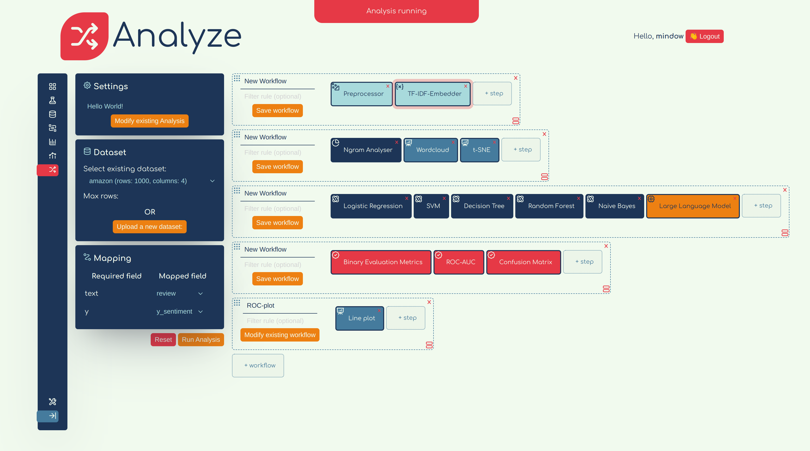
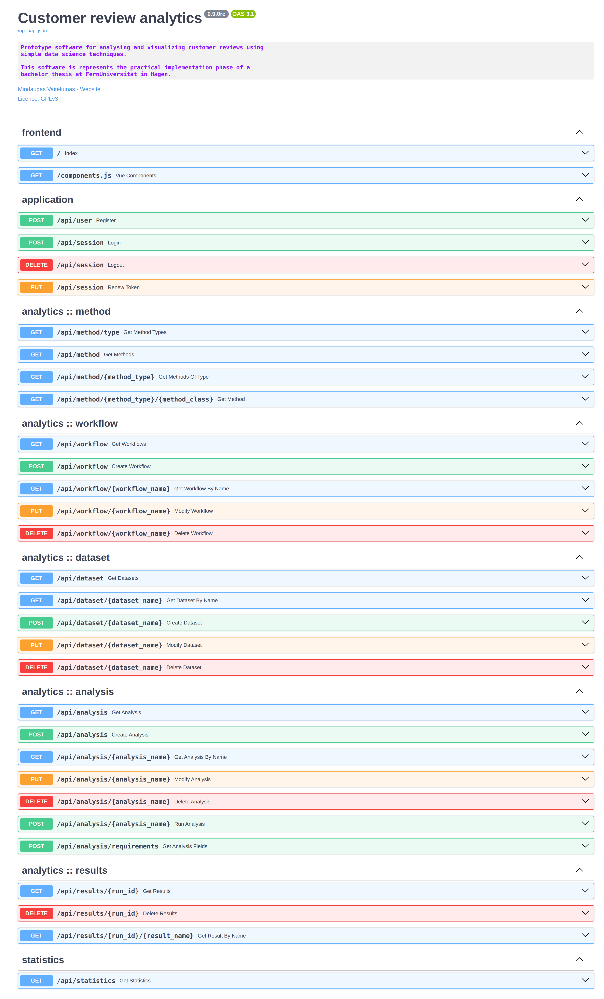

# Customer Review Analytics



This repository offers a proof-of-concept implementation of a Pipeline/Workflow 
framework, along with a web application that leverages it for analyzing and 
visualizing online customer reviews.

## Installation

This application was developed and tested on `Debian 11 (Bullseye)` with `Python 3.12`. 
Functionality on other operating systems or Python versions has not been verified and 
cannot be guaranteed.

```sh
$ python --version
Python 3.12.0
```

Although not required, the use of a virtual environment is recommended to isolate dependencies.

```sh
$ cd <path to repo>
$ python -m venv .env
$ source .env/bin/activate
```

With the environment activated, dependencies can be installed using the `requirements.txt` file:

```sh
$ pip install -r requirements.txt
```

## Usage

This repository consists of two main components: the analytical library 
(`reviewer.framework`) and a web application (`reviewer.webapp`) that utilizes 
it to run analytical pipelines.

**NB**: all of the code-snippets provided below assume they are run in an activated 
virtual environment.

### Analytical framework

The framework provides a flexible, low-level interface for defining analytical pipelines:

```python
from reviewer.framework.step import *
from reviewer.framework import Runtime, Workflow, Analysis, Dataset, Figure

pconfig = PreprocessorConfig(input_field            = "input_text",
                             output_field           = "clean_text",
                             do_stem                = True,
                             do_remove_stopwords    = True,
                             do_remove_punctuation  = True,
                             do_remove_nonascii     = True)

preproc = Preprocessor(config = pconfig)

emconfig = TfIdfEmbedderConfig(input_field        = "clean_text",
                               output_prefix      = "emb_",
                               ngram_range        = (1, 1),
                               max_features       = 1024,
                               use_svd            = True,
                               max_svd_components = 4)

embedder = TfIdfEmbedder(config = emconfig)

lrconfig = LogisticRegressionConfig(input_field                 = "y_sentiment",
                                    output_prob_field           = "y_prob_lr",
                                    output_class_field          = "y_pred_lr",
                                    embedding_prefix            = "emb_",
                                    review_field                = "clean_text",
                                    additional_regressor_fields = [],
                                    classification_threshold    = 0.5)

lr = LogisticRegression(config = lrconfig)

workflow = (Workflow()
             .add(preproc)
             .add(embedder)
             .add(lr))

analysis = Analysis().add(workflow)

df = DataFrame({
    "text": [
        "Absolutely loved it! Will buy again.",
        "Terrible quality. Broke after a day.",
        "Good value for the price.",
        "Not what I expected, but okay.",
        "Exceeded my expectations!",
        "Would not recommend to anyone.",
        "Decent product, fast shipping.",
        "Packaging was poor, item damaged.",
        "Fantastic service and quality.",
        "Meh, it’s fine but not great."
    ],
    "rating": [5, 1, 4, 3, 5, 1, 4, 2, 5, 3],
    "year": [2023, 2022, 2023, 2021, 2024, 2022, 2023, 2021, 2024, 2022],
    "product_id": [101, 102, 101, 103, 104, 105, 103, 102, 104, 101],
    "user_id": [1001, 1002, 1003, 1004, 1005, 1006, 1007, 1008, 1009, 1010],
    "y_sentiment": [1, 0, 1, 0, 1, 0, 1, 0, 1, 0],  
    "y_useful": [1, 0, 1, 0, 1, 0, 1, 0, 1, 0]  
})

ds = Dataset(df)

runtime = Runtime(dataset_constructor = Dataset.new,
                  figure_constructor  = Figure.new)

ds_post, results = analysis.run(runtime, ds, mapping = {"input_text":  "text",  
                                                        "y_sentiment": "y_sentiment"})

```

A more detailed example can be found in `notebooks/framework_example.ipynb`).

### Web-application

The developed web-application simplifies the usage of the analytical framework, as well as 
the management of datasets and results.

#### Environment variables

Following environment variables can be used to configure the web-application. The default
values are used in case a variable is not set:

```python
import os 

WORK_DIR        = os.path.expanduser(os.environ.get("WORK_DIR", "~/reviewer"))
METHOD_REGISTRY = os.environ.get("METHOD_REGISTRY", "webapp/method_registry.json")
DB_NAME         = os.environ.get("DB_NAME", "reviews.sqlite")
SESSION_TTL     = os.environ.get("SESSION_TTL", 60*60*24)
LLM_HOST        = os.environ.get("LLM_HOST", "localhost:11434")
```

#### Startup

The web-application can be started from the `src/reviewer` folder by running the
`uvicorn` command:

```sh
uvicorn webapp.app:socket_app --timeout-keep-alive 6000 
```

Alternativelly, you can run the `./scripts/webapp.sh` script.

If you plan on using a remote LLM-API (`ollama`), pass the environment variable when starting
the application:

```sh 
LLM_HOST=http://<hostname>:11434 uvicorn webapp.app:socket_app --timeout-keep-alive 6000
```

When running the application in development mode, it is recommended to add the `--reload`
flag, which will watch for changes in python files and restart the application when 
a change is detected.

#### REST-API

The web-application provides an extensive REST-API for managing workflows, analyses,
datasets and results:



The UI for trying out the API can be enabled by running the application in `dev` mode, i.e.
`ENV=dev uvicorn webapp.app:socket_app`.

## Assets

The web-application uses icons provided by [Untitled UI](https://www.untitledui.com/free-icons).

## Disclaimer

**This software is provided "as is", without warranty of any kind, express or implied, 
including but not limited to the warranties of merchantability, fitness for a 
particular purpose, and noninfringement.**
